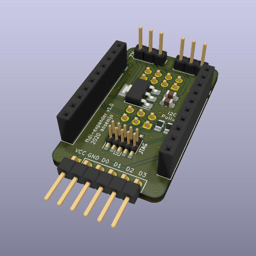
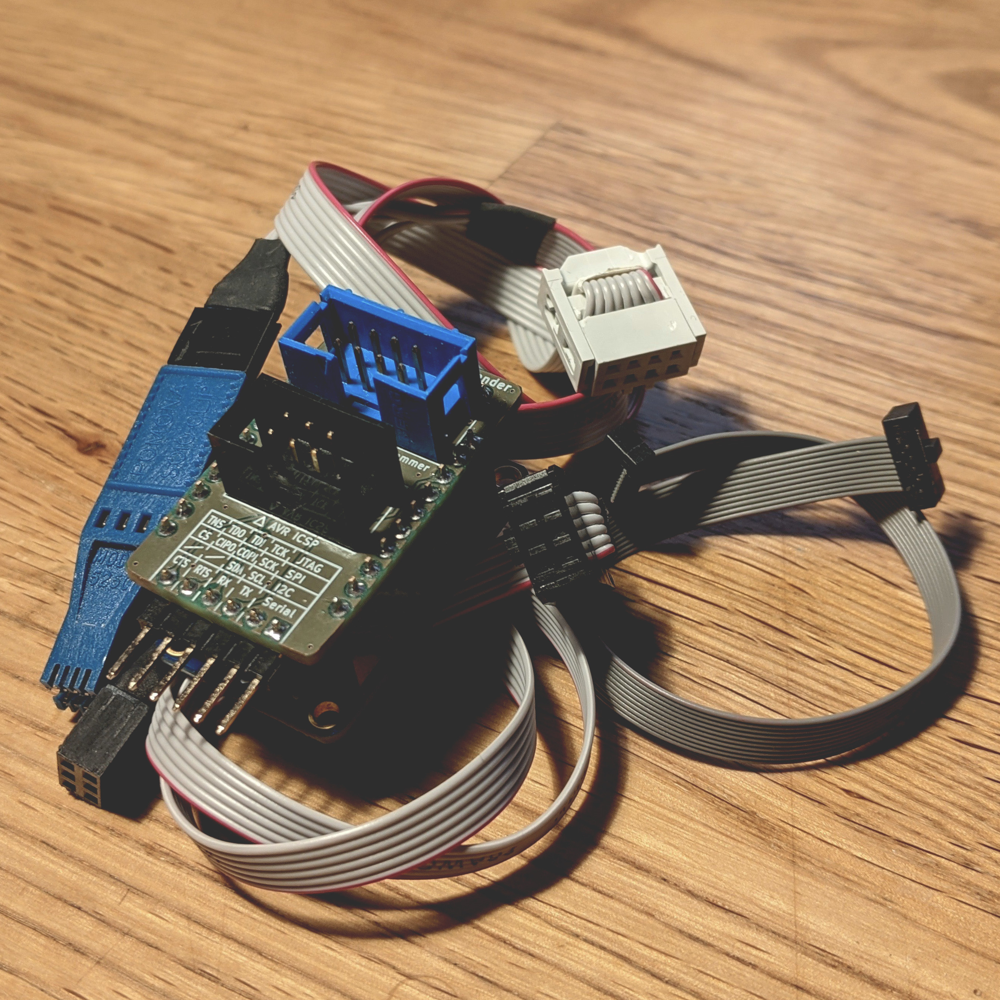

# ftdi-expander

The ftdi-expander is a pretty straightforward circuit board that adds a linear
regulator to 3.3 V, two selection jumpers and a few IDC connectors for commonly
used functions. Except for the availability of the 3.3 V voltage it adds no new
functionality – it simply provides easier connections, so you don't have to mess
with jumper wires every time.

## The FT232H

I love my [Adafruit FT232H](https://www.adafruit.com/product/2264). It is
marketed as a "general purpose USB to ..." adapter. And it turns out it is indeed
very versatile!
This very chip – or its two-channel variant FT2232H – is at the heart of many
different programmers and debuggers.

It has a Python library to toggle GPIOs.  
It can be used to [program AVR chips and Arduinos](https://semjonov.de/docs/tips/arduino/#adafruit-ftdi-ft232h-breakout-board).  
It reads your RTC modules over I2C.  
It flashes your EEPROM with flashrom.  
It is supported by OpenOCD to debug various platforms.  
...

Over time I built myself an assortment of cables to use each function more
conveniently. But this also meant that I couldn't use standard cables .. until now.

## The Expander

See the [schematics](https://raw.githubusercontent.com/ansemjo/ftdi-expander/main/schematics.pdf).




This board plugs into your Adafruit FT232H breakout with two female headers and
adds the following features:

### IC: 3.3 V Linear Regulator + VCC Selection Jumper

Drops the voltage from the 5 V USB VBUS down to 3.3 V. The newer revision of the
Adafruit FT232H with a USB-C receptacle adds a dedicated 3.3 V pin but the older
version which is still found in many shops does not provide that.

At the same time all the output pins of the FT232H are using 3.3 V logic levels
while being *5 V safe*. So all you need to interface with some chips that are
**only** capable of 3.3 V is this additional supply.

The output voltage on the `VCC` pin of all connectors can be selected with a
jumper.

### Jumper: I2C Mode

The documentation to this breakout tells you to connect `D1` and `D2` together
when you want to use I2C. Again, the newer revision of the Adafruit FT232H
brings a simple slider switch to short the pins. But the older revision does
not have this luxury.

Use a jumper to short the pins and "enable" I2C mode.

There's also two optional pullup resistors that can be soldered-on in case your
devices do not bring their own. Use something like 10 kΩ and they should not
interfere with any other actively driven protocols while not in I2C mode.

### Connector: Flash Clip

An 8-pin 2.54mm IDC connector with a pinout that is commonly used for 8-SOIC
flash clips. Can be used e.g. with the [Pomona 5250](https://www.digikey.com/products/en?keywords=501-1311-ND)
in conjuntion with `flashrom` to read and write common EEPROM chips:

```
flashrom -p ft2232_spi:type=232H,port=A,csgpiol=3,divisor=4 -r dump.bin
```

### Connector: AVR ICSP Header

A 6-pin 2.54mm IDC connector with a pinout for AVR programming cables. Can be
used with `avrdude` to rescue your Arduino bootloaders or flash bare Atmel
microcontrollers directly. This method is also a lot faster than bit-banging
with a serial adapter.

```
avrdude -c UM232H -p m328p -U flash:w:firmware.hex:i
```

### Connector: ARM Cortex JTAG

A 10-pin 1.27mm pitch connector that is used on modern ARM Cortex platforms. I
don't have a good guide available but I've used a matching connector on my
[chronovfd](https://github.com/ansemjo/chronovfd) and I was somewhat successful
in getting OpenOCD up and running with the ESP32 module:

```
openocd-esp32 -s /usr/share/openocd-esp32/scripts \
  -f interface/ftdi/um232h.cfg \
  -f board/esp-wroom-32.cfg \
  -c "adapter_khz 1000" \
  ...
```

As I mentioned above, this exact chip is used on other debuggers as well. So if
you need a more generic pinout you can use the ...

### Connector: Labelled Male Header

Electrically, the angled male header at the edge is nothing special at all. It
is almost the exact same pinout as the first six pins on the FT232H itself:
`VCC`, `GND`, `D0`, `D1`, `D2` and `D3`.

The difference is that the VCC pin can be switched between VUSB of 5 V and the
regulated 3.3 V.

Furthermore it adds a handy reference table on the silkscreen so you don't have
to look up pin functions in the documentation anymore.

## License

This project is licensed under a [CERN Open Hardware Licence Version 2 - Permissive](LICENSE) license.
